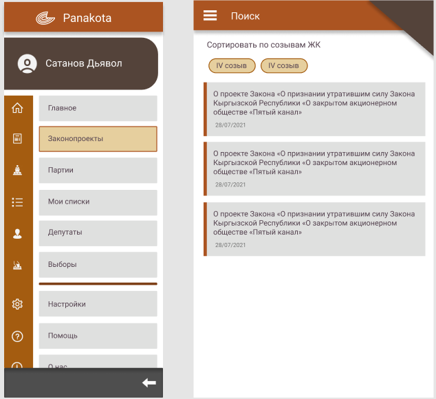
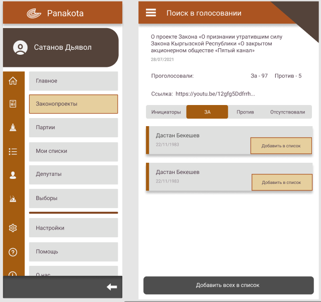

# Panakota - android app

The app, that helps people of Kyrgyzstan to vote wisely. 

## Here, dear user
You are able to see different bills, deputies who voted on, history of deputies

Also you can see list of candidates of political parties at the moments of elections

[technical requirments in Russian](https://docs.google.com/document/d/1IJXPLg5ArQ5ZOlAEH5wkuq_is5oPhWrLDpcZP0dN5Lk/edit?usp=sharing)
### Tech stack
* Jetpack Compose
* Kotlin
* Hilt dagger

### UI
Bills page

Detailed bill

